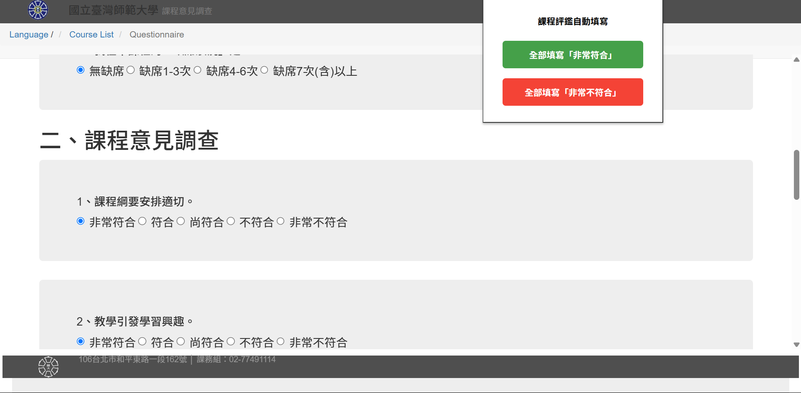

# NTNU Student Courses Feedback Questionnaire Autofill Extension

一個能幫你快速完成臺師大期末課程意見回饋的瀏覽器 Extension，讓你從重複的點擊中解放，省下寶貴的時間！

## About The Project

每到期末，教學意見調查總是讓人感到厭煩。數十個科目幾乎一樣的選項，整個過程既耗時又乏味。

這是一個輕巧的瀏覽器擴充功能，它會在課程評鑑頁面提供一個簡潔的控制面板，只需一鍵，即可根據你的選擇（全部滿意或全部不滿意）自動填寫所有必填欄位，包括那些隱藏在彈出視窗中的「詳細原因」。

## Features

* 🚀 **一鍵完成**：提供「全部填寫非常符合」與「全部填寫非常不符合」兩個選項。
* 🤖 **輕鬆填答**：
    * 自動將「學習自評」設定為「非常符合」與「無缺席」。
    * 自動勾選所有對應的「詳細原因」複選框。
    * 自動根據你的選擇，在建議欄填上有趣的回饋意見文字。
* 🎚️ **滑桿自訂**：根據滑桿選擇自動填寫課程意見調查，可以一次全選 1 到 5 分的評分。
* 🌐 **兼容主流瀏覽器**: 支援 Chrome、Edge 等所有基於 Chromium 的瀏覽器。

## Getting Started

1.  **下載專案**
    * 你可以 `git clone https://github.com/whyhugo/NTNU-Student-Feedback-Autofill.git`
    * 或者直接點擊此 Repo 右下角的 `Releases`，選擇最新的版本 Download `Source code (.zip)`，然後解壓縮。

2.  **開啟瀏覽器擴充功能頁面**
    * **Chrome**: 在網址列輸入 `chrome://extensions`
    * **Edge**: 在網址列輸入 `edge://extensions`

3.  **啟用開發人員模式**
    * 在頁面的**右上角**，找到並<b>開啟「開發人員模式 (Developer mode)」</b>的開關。

4.  **載入擴充功能**
    * 點擊頁面左上角出現的<b>「載入未封裝項目 (Load unpacked)」</b>按鈕。
    * 在跳出的視窗中，選擇你剛剛下載並解壓縮的**整個專案資料夾**。

5.  **完成！**
    * 如果沒有錯誤，你應該能在瀏覽器的工具列上看到這個擴充功能的圖示。
    * 也可以在你的瀏覽器工具列 icon 當中，開啟擴充功能列表來將此工具釘選，方便下一次使用。 

## Usage

1. 進入師大學生教務系統 → 點選「期末課程意見調查登錄」
2. 語言選單點擊右鍵 →<b>「在新分頁開啟」</b> 
   <b style="color: red">很重要！！一定要在新分頁開啟！！</b>
3. 點入任一科目問卷
4. 點擊瀏覽器工具列上的擴充功能圖示
5. 根據需求進行選擇
6. 自動填寫完成！
7. 按下頁面上的「提交表單」按鈕。

## Contributing

Contributions are always welcome! Feel free to open an issue or submit a pull request.